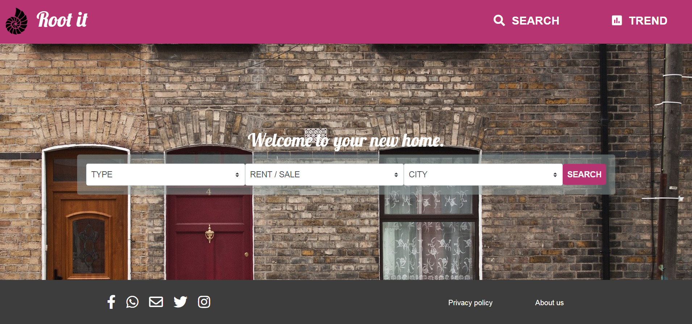

# Directory-capstone

You may go through the pages of this little project, remember this is just an interface approach. So some functionality is missing, but the top 3 pages are connected via the navigation bar and search buttons. The intention here is to create a user interface for a directory of something, in this case, I choose real state (houses for rent or purchase).

In fact, the Home page is where we do the main search, we can set the search specification and click the search button to go to the second page.
Results page, where we can see a kind of graphic list with little information about the results. If we are interested in go deeply into some articles, we just have to click on the image and the third page will appear.
Detail page, this is very detailed information about the item you are interested in.

## Built With

- HTML
- CSS
- Bootstrap
- SASS

## Live Demo

[Live Demo Link](https://alansoto31.github.io/Directory-capstone/)

## Prerequisites 

- Chrome browser

## Set up

 - $ cd "folder location"
 - $ git clone git@github.com:AlanSoto31/Directory-capstone.git
* Install
* Usage 
* Deployment 

## Authors

👤 **Alan Soto** 

- Github: [@AlanSoto31](https://github.com/AlanSoto31)
- Twitter: [@Alan95081574](https://twitter.com/Alan95081574)
- Linkedin: [linkedin Profile](https://www.linkedin.com/in/alan-soto-valle-b9a0511aa/)

 ## Show your support

- Give a ⭐️ if you like this project!

